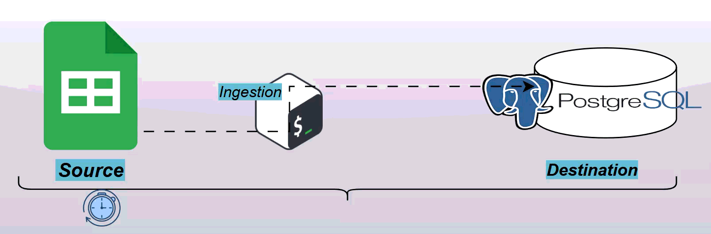

# 🧩 Bash Automation Scripts

This repository contains Bash scripts designed to automate data ETL, file management tasks.
Each script demonstrates shell scripting techniques for automation, data organization, and reproducible workflows.

## 📜 Overview



```bash
.
├── scripts/              # Downloaded raw files
├── data/
│   ├── raw/               # Downloaded raw files
│   ├── transformed/       # After field transformation
│   ├── gold/              # After filtering
│   └── json_and_CSV/      # JSON and CSV  files ready for import
├── logs/
├── .env                   # env file
└── README.md

```
---

## 1️⃣ dir_pipeline.sh – Simple ETL Workflow

A lightweight ETL (Extract, Transform, Load) process implemented entirely in Bash.

Workflow

Extract – Downloads a dataset from a given web URL.

Transform – Performs transformations (e.g., column renaming, filtering, cleanup).

Load – Saves intermediate and final data into dedicated directories representing transformation layers.

## 2️⃣ file_manager.sh – File Organizer

A utility script that scans a parent directory for data files and organizes them by type.

Features

Detects .csv and .json files.

Moves each file to dedicated folder for both csv and json types

Skips if no matching files are found.

## 3️⃣ db_etl.sh – CSV-to-PostgreSQL Loader

This script ingests multiple CSV files into a PostgreSQL database.

Workflow

Scan Directory – Iterates through all .csv files in a given folder.

Database Connection – Connects to a PostgreSQL instance using provided credentials.

Table Management – For each file:

Creates a corresponding table (if it doesn’t exist).

Loads the CSV content into the table.